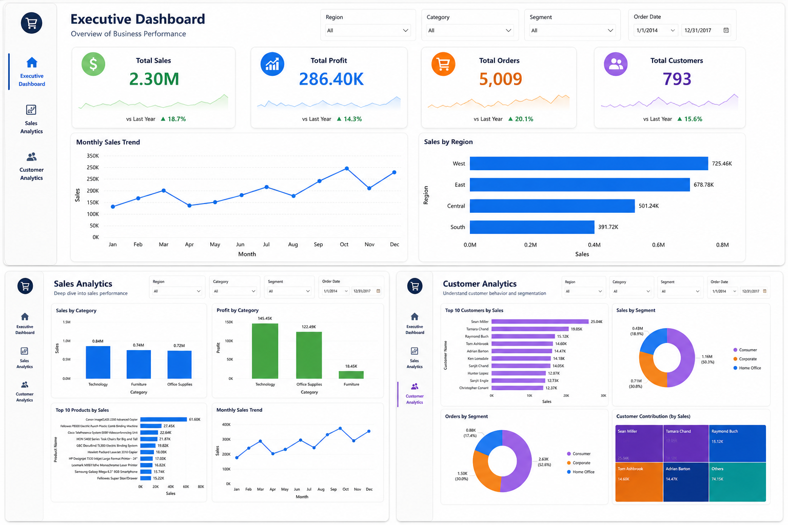

# 📊 E-Commerce Analytics Dashboard

## Overview

The **E-Commerce Analytics Dashboard** is an end-to-end Data Analytics project that analyzes sales performance, profitability, customer behavior, and regional trends using Python and Power BI.

The project demonstrates the complete analytics workflow, including:

- Data Cleaning
- Exploratory Data Analysis (EDA)
- Business KPI Creation
- Interactive Dashboard Development
- Business Insight Generation

---

# 🚀 Features

- Data Cleaning & Preprocessing
- Exploratory Data Analysis (EDA)
- Sales Analysis
- Profitability Analysis
- Customer Analysis
- Regional Performance Analysis
- KPI Dashboard
- Interactive Power BI Dashboard
- Business Recommendations

---

# 🛠 Tech Stack

### Programming

- Python

### Libraries

- Pandas
- NumPy
- Matplotlib
- Seaborn

### Business Intelligence

- Power BI

### Development Tools

- Jupyter Notebook
- VS Code

---

# 📁 Project Structure

```
Ecommerce-Analytics-Dashboard/
│
├── data/
│   ├── cleaned_data.csv.csv
│   └── ss.csv
│
├── notebooks/
│   └── ecommerce_analysis.ipynb
│
├── dashboard/
│
├── docs/
│   └── business_insights.pdf
│
├── screenshots/
│   ├── Dashboard.png.png
│   └── Bussiness_insghts_dashboard.png
│
├── README.md
└── requirements.txt
```

---

## Business Insights Dashboard



---

# 📊 Exploratory Data Analysis

The following analyses were performed:

- Missing Value Analysis
- Duplicate Detection
- Statistical Summary
- Sales Distribution
- Profit Analysis
- Customer Analysis
- Category-wise Analysis
- Regional Analysis
- Correlation Analysis

### Visualizations

- Bar Charts
- Pie Charts
- Histograms
- Box Plots
- Heatmaps
- Line Charts

---

# 📌 Key Business Insights

## Sales

- Technology products generated the highest sales.
- Office Supplies maintained consistent sales.
- Sales peaked during festive periods.

## Profitability

- Technology category produced the highest profit.
- Heavy discounts reduced profit margins for some products.

## Customers

- A small group of customers generated a significant share of revenue.
- Consumer and Corporate segments contributed the highest sales.

## Regions

- West region achieved the highest sales.
- Some regions showed strong revenue but lower profitability.

---

# 📊 Dashboard KPIs

- Total Sales
- Total Profit
- Total Orders
- Total Customers
- Average Order Value
- Profit Margin
- Regional Sales

---

# ▶️ How to Run

## Clone Repository

```bash
git clone https://github.com/Lakshmankumarr/Ecommerce-Analytics-Dashboard.git
```

## Install Requirements

```bash
pip install -r requirements.txt
```

## Run Notebook

```bash
jupyter notebook
```

Open

```
notebooks/ecommerce_analysis.ipynb
```

---

# 📄 Project Report

The project report is available inside

```
docs/business_insights.pdf
```

---

# 📚 What I Learned

- Data Cleaning
- Exploratory Data Analysis
- Data Visualization
- Power BI Dashboard Development
- Business KPI Design
- Business Reporting
- Insight Generation

---

# 💼 Resume Description

Built an end-to-end E-Commerce Analytics Dashboard using Python, Pandas, NumPy, Matplotlib, Seaborn, and Power BI. Performed data cleaning, exploratory data analysis, KPI development, dashboard creation, and generated actionable business insights for decision-making.

---

# 🚀 Future Improvements

- Sales Forecasting
- Customer Churn Prediction
- Product Recommendation System
- Automated Reporting
- Real-Time Dashboard
- Power BI Service Deployment

---

# 👨‍💻 Author

**Lakshman Kumar**

B.Tech CSE (Data Science)

Aspiring Data Analyst | Data Scientist | Machine Learning Enthusiast

⭐ If you found this project useful, consider giving it a star!
